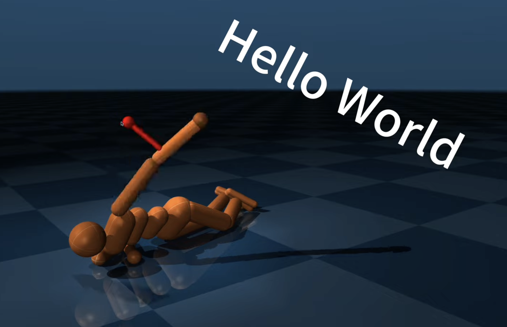
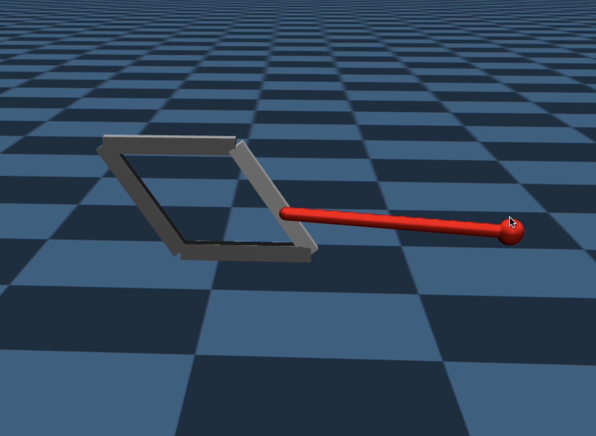

# Robotics Studio - MuJoCo Demos


This repository contains a collection of introductory demo scripts for the [MuJoCo](https://mujoco.org/) physics simulator, developed for the **Robotics Studio** class. 


---

## Demos

This project includes several Python scripts demonstrating various MuJoCo features:

* **`hello_mujoco_humanoid.py`**: Loads and displays a humanoid model using `mujoco.viewer`. This serves as a basic "hello world". It uses the `robot_descriptions` package to find the model path.
* **`two_bars_demo.py`**: Runs a simulation for the `two_bars.xml` model, demonstrating a simple two-linkage system.
* **`four_bars_demo.py`**: Runs a simulation for the `four_bars.xml` model, showing a four-bar linkage.
* **`sinusodal_demo.py`**: Loads the `ant_pos_ctrl.xml` model and applies a sinusoidal control signal to one of the ant's hip actuators, making it wiggle.
* **`ctrl_modes_demo.py`**: Demonstrates the three different actuator control modes (torque, position, and velocity) using the `control_demo.xml` file.
* **`urdf2mjcf.py`**: A utility script to convert a URDF file to MuJoCo's MJCF XML format.


---

## Asset Files

The `/asset` directory contains all the MuJoCo XML (MJCF) models used by the demo scripts:

* **`demo.xml`**: A commented, basic template file showing the common structure of an MJCF file.
* **`two_bars.xml`**: A simple model with two bodies connected by a hinge joint.
* **`four_bars.xml`**: A model of a four-bar linkage, demonstrating kinematic constraints and equality connections.
* **`ant_origin.xml`**: An ant quadruped model with torque-based motor actuators.
* **`ant_pos_ctrl.xml`**: A modified version of the ant model that uses position-based actuators.
* **`control_demo.xml`**: A model with three independent poles, each driven by a different actuator type (motor, position, velocity) for comparison.

---

## Requirements

The scripts require the `mujoco` Python package.

```bash
pip install mujoco